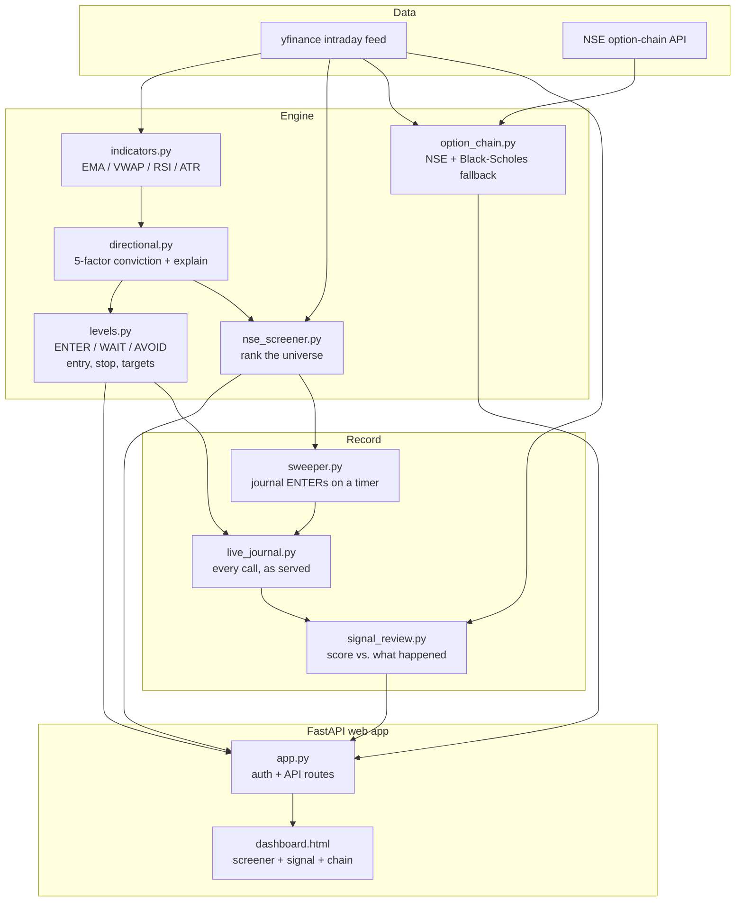

# Atlas

A free, self-hosted **entry-timing engine** for NSE options trading.

Atlas is not an auto-trader. You pick a stock, and it tells you three things:

1. **When** to enter — a clear `ENTER` / `WAIT` / `AVOID` call, so you stop chasing extended moves.
2. **Where** to exit — an ATR-based stop-loss and layered take-profit targets (1R / 2R / 3R).
3. **Why** — the exact factors behind the signal, and how it maps to the option you'd buy.

You place the trade in your own broker. Atlas is the cockpit, not the autopilot.

---

## Honest note

Extensive backtesting (see `backtest/`) showed that simple technical signals do **not**
reliably predict short-term price direction. So Atlas is framed as a **decision-support
and discipline tool**, not a money printer. Its real value is the `WAIT` and `AVOID`
calls — keeping you out of chop and off extended entries. The edge stays with your
judgment.

---

## What it does

- **Screener** — scans ~180 liquid F&O stocks and ranks them by directional conviction.
- **Entry signal** — for any stock: `ENTER` (good entry now), `WAIT` (right bias, wrong
  price — wait for the trigger), or `AVOID` (no clean edge). Includes the entry price,
  stop-loss, and 1R/2R/3R targets.
- **Why-this-trade** — a plain-English breakdown of the 5 signal factors (trend, VWAP,
  momentum, opening-range, volume).
- **Option chain** — live NSE chain (with a Black-Scholes fallback), so you can pick a strike.
- **Option projection** — click a Call/Put to see its premium projected at the stop and targets.
- **Track record** — every call the app served is journaled and scored against what price
  actually did next, so the hit rate on screen is measured, not remembered.

---

## The signal engine

Each stock gets a signed conviction score in `[-1, +1]` from five independent factors:

| Factor          | Bullish when                        |
| --------------- | ----------------------------------- |
| Trend           | EMA 9 above EMA 21                  |
| VWAP            | Price above VWAP                    |
| Momentum (RSI)  | RSI above 50                       |
| Opening range   | Price breaks the opening-range high |
| Volume          | Gates conviction (no volume = weak) |

The **entry-timing** layer then decides *when*:

- `AVOID` — conviction too low; factors disagree.
- `ENTER` — a fresh breakout on volume, or price sitting at VWAP value in a clean trend.
- `WAIT`  — bias is right but price is extended (don't chase) or hasn't hit a trigger yet.

Stop-loss and targets are always measured from the **planned entry price**, not just the
current price.

### Decisions are made on closed bars

Every gate is evaluated on the last **closed** bar. A forming candle's close — and so its
EMAs, MACD, RSI, ADX and every confluence vote — keeps moving until the bar ends, so a
signal taken from it repaints: an `ENTER` on screen can quietly become an `AVOID` before
the candle finishes. The live price is still used for the one thing it is actually good
for, the fill you would get (`entry`), and the response reports `bar_time`, `signal_px`
and `drift_atr` so you can see how far price has run since the decision bar closed.

The same discipline applies to the opening range, which expands bar by bar inside the
window instead of being backfilled with the window's final high — otherwise the breakout
vote reads the future for the first half hour of every session.

---

## The track record is measured, not remembered

Every signal the dashboard serves is written to `data_store/live_signals.parquet` — the
status, the entry, the stop and the targets that were on screen at that moment. One row
per `(symbol, bar_time)`, so refreshing the page mid-bar cannot inflate the log with the
same decision twice.

Journaling only what you click would make the track record a sample of your *attention* —
you click what looks interesting, so the log inherits every bias you were trying to check
for. So `engine/sweeper.py` also runs on a timer inside the app: each pass it screens the
universe, takes the strongest candidates by absolute conviction, and journals every
`ENTER` whether or not anyone is watching. Set `ATLAS_SWEEP=0` to turn it off, or run it
as its own process with `python -m engine.sweeper`.

`engine/signal_review.py` then scores each `ENTER` against the bars that followed it. Two
rules keep the number honest rather than flattering:

- **Only bars after the decision bar count.** Scoring the decision bar itself would be
  reading the data the decision was made from.
- **When one bar touches both the stop and a target, the stop wins.** Intraday OHLC does
  not record which came first, and assuming the good one is exactly how a backtest ends up
  describing a strategy nobody could have traded.

A call still open at 15:15 is closed there at that bar's close (`TIMEOUT`) — this is an
intraday tool, so a position you had to flatten is not a pending winner. The panel reports
hit rate, expectancy in R, and MFE/MAE per call.

```
GET /api/journal    →  {summary: {win_rate, expectancy_r, total_r, ...}, rows: [...]}
```

---

## Access control

Atlas logs in by emailed one-time code. When SMTP isn't configured it falls back to
printing the code on the verify page, which is convenient on localhost and an
authentication bypass anywhere else — the code is the only credential, so showing it to
whoever asks lets anyone sign in as anyone.

So the code is shown **only when the server is bound to loopback**. Tell Atlas where it is
bound with `ATLAS_BIND_HOST` (the `python -m web.app` entrypoint reads it and binds
there). On any other address you need one of:

| Setting | Effect |
| ------- | ------ |
| `SMTP_HOST` / `SMTP_USER` / `SMTP_PASS` | codes are emailed, never displayed |
| `ATLAS_ALLOWED_EMAILS` | comma-separated list of who may sign in at all |

With neither, a network-bound Atlas refuses logins and says why, rather than quietly
serving an open door. Sessions are signed with an on-disk secret (`ATLAS_SECRET_KEY` to
override) and the OTP expires in 10 minutes after at most 5 attempts.

---

## The universe prunes itself

NSE's F&O list changes; a static Python list does not. Symbols get delisted, renamed and
demerged — `TATAMOTORS` is the live example, and every scan spent a network round trip on
a ticker that can never return a row.

`data/universe_health.py` tracks failures in `data_store/universe_health.json`. A symbol
is dropped only after **3 consecutive** failures, so one flaky afternoon at the data
provider can't shrink the universe; the mark expires after **7 days**, so anything that
recovers comes back; and a single success clears the record immediately.

```bash
python -m data.universe_health              # what's excluded and why
python -m data.universe_health --validate   # re-check every symbol now
```

---

## Architecture



---

## Tests

```bash
pytest
```

The suite is offline (no yfinance, no NSE) and exists to pin down the invariants that are
easy to break silently:

- **No repaint** — the same closed history, with and without a wild in-progress bar glued
  on, must produce an identical decision.
- **No lookahead** — recomputing the opening range on a truncated frame must not change
  any earlier value.
- **Gate parity** — `engine/evaluate.py` reimplements the gate cascade vectorised for
  speed; it is driven against the live `_decide` over thousands of random gate states, so
  the published hit rates can never end up describing an engine nobody trades.
- **Fresh data** — the intraday parquet cache expires, because a signal computed on
  yesterday's bars is worse than no signal.
- **Pessimistic scoring** — a bar that touches both the stop and a target scores as a
  stop, bars at or before the decision bar never score, and an open call is never counted
  as a win. These are the assumptions that decide whether the published hit rate means
  anything.
- **No double-counting** — the same `(symbol, bar_time)` cannot enter the journal twice,
  so re-opening the page mid-bar doesn't quietly pad the sample.

---

## Quickstart

```bash
python -m venv venv && source venv/bin/activate
pip install -r requirements.txt -r requirements-dev.txt

cp .env.example .env        # then edit it
uvicorn web.app:app --reload --port 8000
```

Then open **http://127.0.0.1:8000** and sign in — the login code is printed on the page.

To reach it from another device on your network, set `ATLAS_ALLOWED_EMAILS` (or SMTP) in
`.env` first, then:

```bash
ATLAS_BIND_HOST=0.0.0.0 python -m web.app
```

Without one of those, Atlas will refuse the login rather than show the code to the
network. See [Access control](#access-control).

> The NSE option-chain API works from an Indian residential IP. When it is unreachable,
> Atlas falls back to a theoretical Black-Scholes chain so strikes always render.

---

## Project structure

```
atlas/
  data/          yfinance client, NSE universe, option chain
  engine/        indicators, directional score, entry levels, screener
  web/           FastAPI app, auth, templates, static
  backtest/      backtest engines, metrics, optimizer
  storage/       trade + live signal journal (Parquet)
  config/        settings (.env driven)
```

---

## Tech

Python 3.12+, pandas / numpy, pandas-ta, FastAPI, Jinja2. Free data (yfinance + NSE public
API). Dependencies are pinned in `requirements.txt` — pandas-ta tracks pandas and numpy
closely, and an unpinned install has silently broken the indicator stack before. CI runs
the suite on 3.12 and 3.13.

## License

MIT — see [LICENSE](LICENSE).

---

## Disclaimer

For educational use only. Not investment advice. Options carry theta decay and direction
risk. Trade at your own risk.
