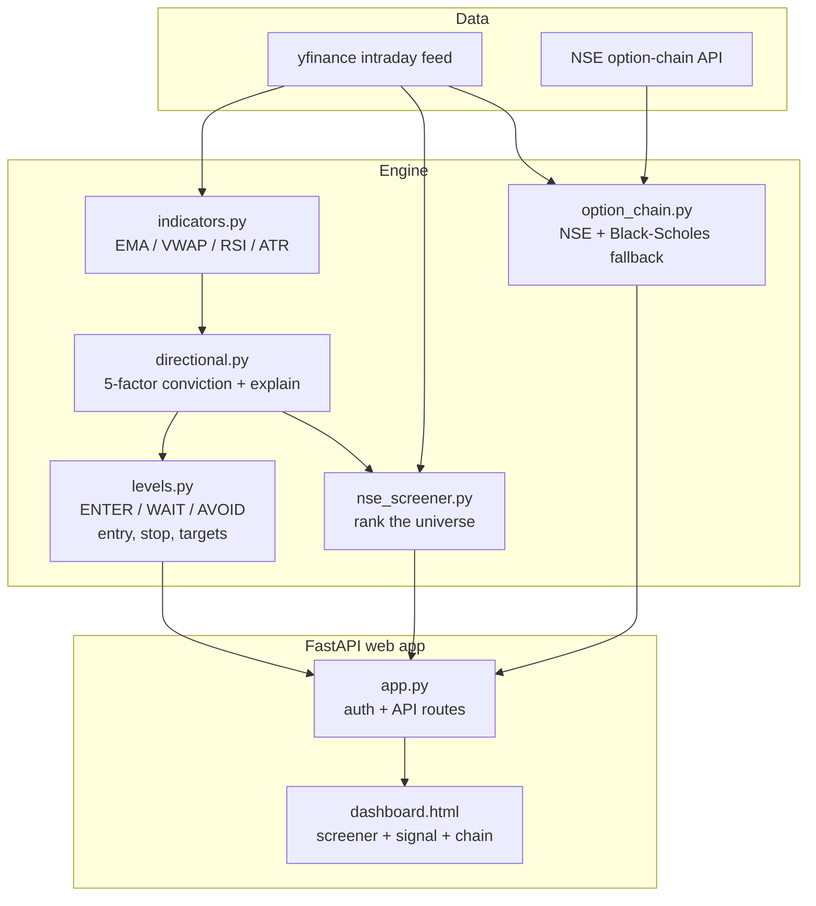

# Atlas

A free, self-hosted **entry-timing engine** for NSE options trading.

Atlas is not an auto-trader. You pick a stock, and it tells you three things:

1. **When** to enter — a clear `ENTER` / `WAIT` / `AVOID` call, so you stop chasing extended moves.
2. **Where** to exit — an ATR-based stop-loss and layered take-profit targets (1R / 2R / 3R).
3. **Why** — the exact factors behind the signal, and how it maps to the option you'd buy.

You place the trade in your own broker. Atlas is the cockpit, not the autopilot.

---

## Honest note

Extensive backtesting (see `backtest/`) showed that simple technical signals do **not**
reliably predict short-term price direction. So Atlas is framed as a **decision-support
and discipline tool**, not a money printer. Its real value is the `WAIT` and `AVOID`
calls — keeping you out of chop and off extended entries. The edge stays with your
judgment.

---

## What it does

- **Screener** — scans ~180 liquid F&O stocks and ranks them by directional conviction.
- **Entry signal** — for any stock: `ENTER` (good entry now), `WAIT` (right bias, wrong
  price — wait for the trigger), or `AVOID` (no clean edge). Includes the entry price,
  stop-loss, and 1R/2R/3R targets.
- **Why-this-trade** — a plain-English breakdown of the 5 signal factors (trend, VWAP,
  momentum, opening-range, volume).
- **Option chain** — live NSE chain (with a Black-Scholes fallback), so you can pick a strike.
- **Option projection** — click a Call/Put to see its premium projected at the stop and targets.

---

## The signal engine

Each stock gets a signed conviction score in `[-1, +1]` from five independent factors:

| Factor          | Bullish when                        |
| --------------- | ----------------------------------- |
| Trend           | EMA 9 above EMA 21                  |
| VWAP            | Price above VWAP                    |
| Momentum (RSI)  | RSI above 50                       |
| Opening range   | Price breaks the opening-range high |
| Volume          | Gates conviction (no volume = weak) |

The **entry-timing** layer then decides *when*:

- `AVOID` — conviction too low; factors disagree.
- `ENTER` — a fresh breakout on volume, or price sitting at VWAP value in a clean trend.
- `WAIT`  — bias is right but price is extended (don't chase) or hasn't hit a trigger yet.

Stop-loss and targets are always measured from the **planned entry price**, not just the
current price.

---

## Architecture



---

## Quickstart

```bash
python -m venv venv && source venv/bin/activate
pip install -r requirements.txt

uvicorn web.app:app --reload --port 8000
```

Then open **http://127.0.0.1:8000** and sign up. To reach it from another device on your
network, run with `--host 0.0.0.0`.

> The NSE option-chain API works from an Indian residential IP. When it is unreachable,
> Atlas falls back to a theoretical Black-Scholes chain so strikes always render.

---

## Project structure

```
atlas/
  data/          yfinance client, NSE universe, option chain
  engine/        indicators, directional score, entry levels, screener
  web/           FastAPI app, auth, templates, static
  backtest/      backtest engines, metrics, optimizer
  storage/       trade + signal journal (Parquet)
  config/        settings (.env driven)
```

---

## Tech

Python, pandas / numpy, pandas-ta, FastAPI, Jinja2. Free data (yfinance + NSE public API).

---

## Disclaimer

For educational use only. Not investment advice. Options carry theta decay and direction
risk. Trade at your own risk.
